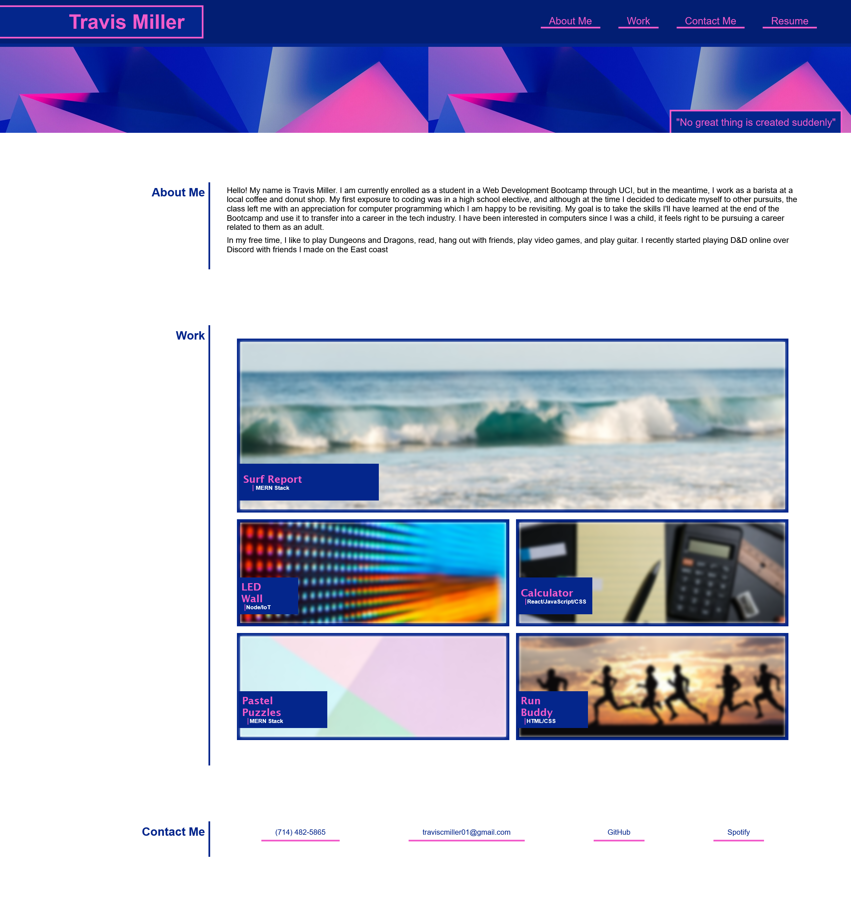

# Travis Miller Portfolio - UCI Module 2 Challenge - Advanced CSS

## Description

Provide a short description explaining the what, why, and how of your project. Use the following questions as a guide:

- What was your motivation?
- Why did you build this project? (Note: the answer is not "Because it was a homework assignment.")
- What problem does it solve?
- What did you learn?

This is a website that in the future may serve as a framework for a professional portfolio for a web development career after the UCI Coding Boot Camp. The website is built using a collection of flexboxes and other css elements that help the HTML code pop in a browser window. The website is broken up into 4 main sections: the header that houses the title and the navigation bar, an about me section that gives the user some info about me (the coder), a works section providing links to coding projects which will eventually highlight the skills I have learned throughout the course, and a final section that contains contact information.

## Installation

N/A

## Usage
In order to use this website, open the webpage (https://tcmiller30.github.io/uci-module-1-challenge/) in your browser to launch the homepage. To confirm non-semantic elements were replaced with semantic elements, you can open the browser's DevTools/Inspector--CTRL+Shift+I for Windows, CMD+Option+I for Mac--which will open a console panel on the side of your screen displaying the site's code.

The Navbar at the top right of the screen can be used to quickly navigate to different sections of the website. The cards in the "Work" section are links that will send the user to the respective projects. There is a second navbar in the "Contact Me" section that the user can use to find a way to contact me (the coder(Travis Miller)).

The webpage should be responsive when viewed on different sized screens

Below is a screenshot of what the website looks like at fullsize.

    

## Credits

MDN Web Docs
- https://developer.mozilla.org/en-US/docs/Learn/CSS/CSS_layout/Flexbox
- https://developer.mozilla.org/en-US/docs/Learn/CSS/Building_blocks/The_box_model

CSS-Tricks

- https://css-tricks.com/snippets/css/a-guide-to-flexbox/
- https://css-tricks.com/a-complete-guide-to-css-media-queries/
    

## License

MIT License

Copyright (c) [2022] [Travis Miller]

Permission is hereby granted, free of charge, to any person obtaining a copy of this software and associated documentation files (the "Software"), to deal in the Software without restriction, including without limitation the rights to use, copy, modify, merge, publish, distribute, sublicense, and/or sell copies of the Software, and to permit persons to whom the Software is furnished to do so, subject to the following conditions:

The above copyright notice and this permission notice shall be included in all copies or substantial portions of the Software.
THE SOFTWARE IS PROVIDED "AS IS", WITHOUT WARRANTY OF ANY KIND, EXPRESS OR IMPLIED, INCLUDING BUT NOT LIMITED TO THE WARRANTIES OF MERCHANTABILITY, FITNESS FOR A PARTICULAR PURPOSE AND NONINFRINGEMENT. IN NO EVENT SHALL THE AUTHORS OR COPYRIGHT HOLDERS BE LIABLE FOR ANY CLAIM, DAMAGES OR OTHER LIABILITY, WHETHER IN AN ACTION OF CONTRACT, TORT OR OTHERWISE, ARISING FROM, OUT OF OR IN CONNECTION WITH THE SOFTWARE OR THE USE OR OTHER DEALINGS IN THE SOFTWARE.
---
